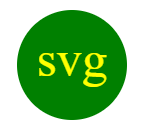

# SVG Logo Maker

## Description

This week 10 objective is to create in javascript a logo.svg generator using fs, inquirer and jest packages.

SVG Logo Maker walkthrough video: https://drive.google.com/file/d/1oc7JToozHVFLzCczMmcCShUKgSAB5STL/view

Generated SVG example:

## Installation
N/A

## Usage
Just download the code or clone it to your local folder and type node index.js into your terminal in the index.js route to start the inquirer prompts in the console.
Prompts in the console will appear and you will be able to answer them with your desired data.

## Credits
N/A

## License
N/A
